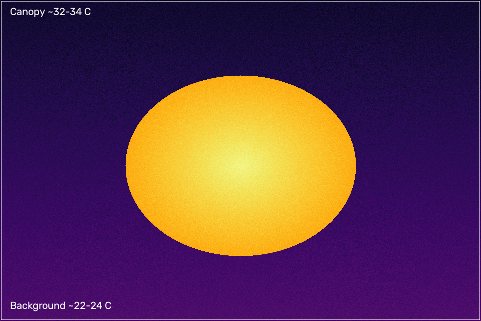
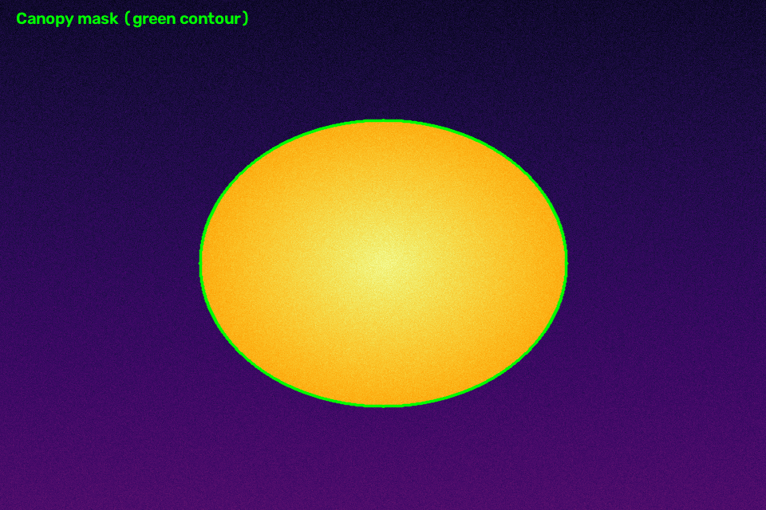
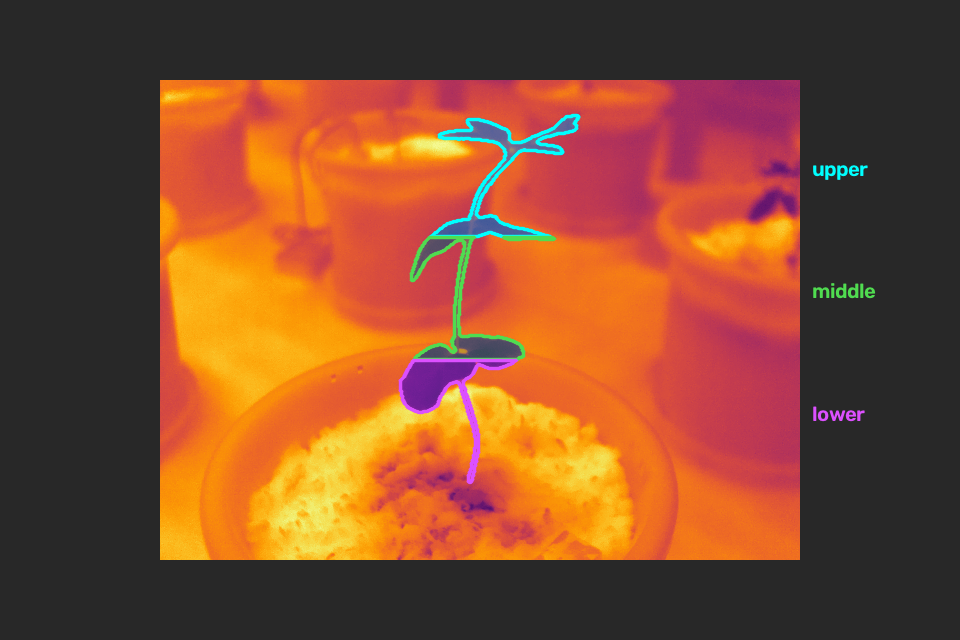
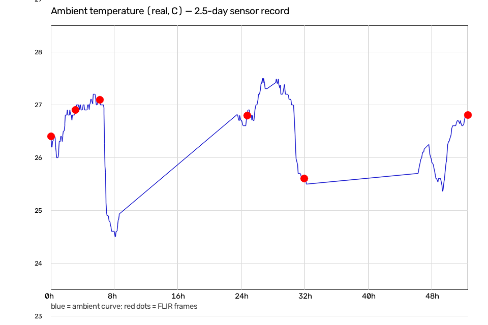
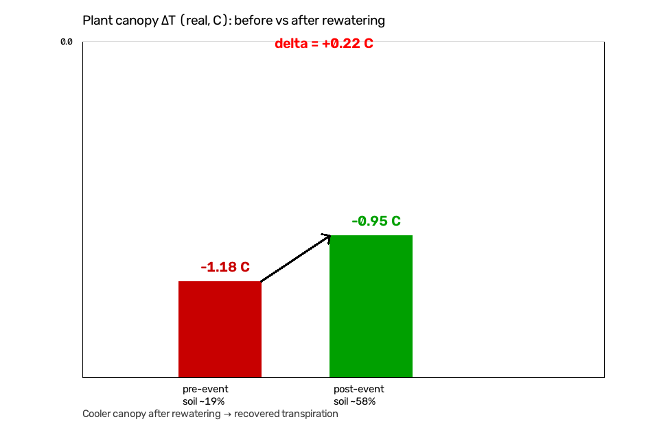

> 📖 English documentation: [README.md](./README.md)

# PhenoCV


> 可组合、多模态的**植物表型**工具箱 —— 各模块共享同一个 `phenocv.core`；
> [SAM 2](https://github.com/facebookresearch/sam2) 只是一种*可选的*分割后端，并非
> 项目本体。当前已发布三个模块：`segmentation`、`phenotypes`、`thermal`。

[](https://pypi.org/project/phenocv/)
[](https://pypi.org/project/phenocv/)
[](./LICENSE)
[](https://github.com/perseus-wy/PhenoCV/actions/workflows/ci.yml)
[](./docs/)


PhenoCV 不是单个算法，而是一套**可组合、可插拔**的植物表型视觉模块。当前已提供三个，地位平等：

- **`phenocv.segmentation`**：用**少量人工标注的关键帧**，得到**完整时序的分割掩膜**。
  默认后端采用 [SAM 2](https://github.com/facebookresearch/sam2) 视频传播，但引擎**与数据源无关**，
  任何数据集格式都可通过轻量**适配器（adapter）**接入。SAM 2 只是多种后端之一
  （Classical 与 YOLO 后端被设计为可即插即换的替代项 —— 见[架构](#-架构)）。
- **`phenocv.phenotypes`**：**四级、失败即留痕的表型引擎**，从一张植株掩膜
  （外加可选 RGB / 深度 / 多光谱）算出一张扁平的表型表：2D 形状 → RGB 植被指数 →
  3D 高度/体积 → 多光谱指数。它只运行你**实际提供输入**的那些提取器。
- **`phenocv.thermal`**：**纯 CPU 的热红外（FLIR）表型模块**：逐像素温度表型、
  按相对高度划分的上/中/下层冠层温度、冠层相对环境的 ΔT、环境传感器时序对齐，
  以及前后对照的胁迫/复水分析（移动块 bootstrap + HAC 不确定性）。核心仅依赖
  `numpy` + `cv2` + `pandas` + `scipy` + `statsmodels`（后两者懒加载），无需 GPU；
  可选的 SAM 2 时序分割层懒加载。

三个模块都构建在共享的 **`phenocv.core`**（表型提取器注册表 + 模态/适配器注册表 + IO 工具）
之上；因此新增模块（例如 `phenocv.counting`）只需「写一个包、注册你的工具」——核心无需改动。

> **🖼️ About the figures.** Every image in this README is **desensitized**: the
> first two are rendered from a fully synthetic demo (no real field data); the
> thermal figures are method illustrations with calibration boards and labels
> removed. They illustrate the *method*, not any specific experiment or genotype.

> **🖼️ 关于图中的图像。** 本 README 中的每一张图都经过**脱敏**：前两张来自
> 完全合成的样本（无真实田间数据）；热红外图为方法示意，已移除标定板与标签。
> 它们只用于说明*方法*，不代表任何具体实验或基因型。

---

## 🌟 Why PhenoCV


- **可组合，非单体**：分割模块、表型引擎、热红外模块，可单独或任意组合使用，各自独立、可单独导入。
- **失败即留痕、可审计**：每个表型行都记录 `pred_source` / `_inputs` / `_extractors_run`，
  不可观测的输出为 `NaN` + `missing_reason`——绝不伪造。
- **无需额外标注的 QA**：留一法（LOO）在你真实的锚帧上报告 IoU / Boundary-F1，无需任何额外标注；
  且所有输出都带溯源标签。
- **幼苗友好**：ROI 裁剪把早期幼苗的有效分辨率提升约 10×（否则传播后端会把每帧缩放到 1024px，把幼苗压没）。
- **CPU 可测**：整个逻辑层（ROI 运算、阈值阶梯、救援、IoU/BF1、表型引擎、热红外栈）无需 CUDA ——
  CI 与贡献者都不需要 GPU。
- **分割后端无关**：SAM 2 是默认而非必须；`BaseSegmenter` 契约允许 Classical 与 YOLO 后端即插即换。


---

## ✨ Modules


| 模块 | 能力 |
|---|---|
| `phenocv.segmentation` | 时序冠层分割，可插拔后端（默认 SAM 2；Classical / YOLO 设计为即插即换）。双向（正向+反向）logits 平均，阈值阶梯回退 + 点救援，LOO IoU/BF1 QA，可插拔适配器，ISAT/CSV/QA 导出 |
| `phenocv.phenotypes` | 四级表型引擎：2D 形状（面积/ bbox/ 实心度…）、RGB 植被指数（ExG/ExR/VARI…）、3D 高度/体积（mm，需深度+内参）、多光谱指数（12 个 + 反射率统计） |
| `phenocv.thermal` | 纯 CPU 热红外表型：温度表型（`temp_*` 列名）、按相对高度划分的上/中/下层冠层温度、冠层相对环境 ΔT、环境传感器对齐（禁止外推、缺口防护）、前后对照胁迫分析（移动块 bootstrap CI + HAC + 光暗对照）；可选的 SAM 2 分割层 |
| `phenocv.core` | 所有模块共享的表型提取器**注册表**（`@register`）+ 模态/适配器**注册表** + 极简 IO 工具（掩膜 / RGB / 深度 / 多光谱 / 热红外读取器） |


See [Roadmap](#-roadmap) for what is planned next.

---

## 💿 Installation


```bash
# 核心（仅 CPU，引擎/适配器/测试均不需要 torch）
pip install phenocv

# 源码安装 + 开发工具（pytest）
pip install -e ".[dev]"

# 可选：GPU 视频传播（SAM 2 后端）
pip install "phenocv[video]"
```

> **说明：** `video` 额外依赖会拉入 `torch` + `sam2`，用于 SAM 2 *分割后端*。实际跑分割需要
> SAM 2 权重（如 `sam2.1_hiera_l.pt`）及其模型配置（如 `sam2.1_hiera_l.yaml`，随 `sam2` 包提供）。
> 其余部分 —— 适配器、配置、表型引擎、热红外栈、CPU 单元测试 —— 都不需要它。其它分割后端
> （Classical / YOLO）正以同一 `BaseSegmenter` 契约加入，无需 SAM 2。

---

## 🚀 Quickstart


PhenoCV 的三个模块相互独立 —— 按需使用其中任何一个。

### 1. 生成合成示例（无真实数据，纯 CPU）

```bash
python tools/make_demo_sample.py --out samples/demo
```

生成 `samples/demo/{frames,masks,manifest.csv}` —— 一个随时间增大的绿色圆盘，共 6 帧、3 个稀疏锚帧。

### 2. 分割（多个模块入口之一）

```bash
phenocv segment \
  --adapter csv \
  --manifest samples/demo/manifest.csv \
  --config configs/default.yaml --preset plant_phenotyping \
  --checkpoint /path/to/sam2.1_hiera_l.pt \
  --model-cfg sam2.1_hiera_l.yaml \
  --output results/demo \
  --device cuda
```

结果落在 `results/demo/`（见 [输出与 QA](#-输出与-qa)）。

### 3. 从掩膜计算表型

```bash
phenocv phenotype \
  --mask results/demo/plant_01/<stem>.png \
  --rgb  /local/mirror/rgb/<stem>.png \
  --depth /local/mirror/depth_mm/<stem>.png \
  --calibration configs/intrinsics_second.yaml \
  --out results/demo/traits/plant_01_<stem>.json
```

### 4. 编程 API

```python
# 分割
from phenocv.segmentation.adapters import CsvManifestAdapter
from phenocv.segmentation.config import load_config
from phenocv.segmentation.engine import run_sam2_video_temporal

sequences = CsvManifestAdapter("samples/demo/manifest.csv").build_sequences()
cfg = load_config("configs/default.yaml", preset="plant_phenotyping")

result = run_sam2_video_temporal(
    sequences,
    output_root="results/demo",
    checkpoint="/path/to/sam2.1_hiera_l.pt",
    model_cfg="sam2.1_hiera_l.yaml",
    device="cuda",
)
print(result["loo_summary_interior"])  # IoU / BF1 中位数
```

```python
# 表型
import cv2
import numpy as np
from phenocv.phenotypes import compute_traits

mask = (cv2.imread("mask.png", 0) > 0)
rgb = cv2.cvtColor(cv2.imread("rgb.png"), cv2.COLOR_BGR2RGB)
row = compute_traits(mask=mask, rgb=rgb)   # 只运行你传入输入所满足的提取器
print(row)
```

### 5. 纯 CPU 冒烟测试（无 GPU、无 SAM 2）

```bash
pip install -e ".[dev]"
pytest                      # 30 个测试，全部 CPU
python -c "import phenocv; print(phenocv.list_modules())"
```

---

## 🧩 Adapter Contract


引擎消费 `PlantSequence` 对象。默认的 `CsvManifestAdapter` 读取**单个 manifest**，
无需任何数据集代码：

| 列名 | 类型 | 必填 | 含义 |
|---|---|---|---|
| `sequence_key` | str | ✅ | 序列 id，如 `plant_01` |
| `frame_idx` | int | ⚪ | 0 基时序索引（缺省按行序） |
| `frame_path` | str | ✅ | RGB 帧路径 |
| `frame_label` | str | ⚪ | 可读标签（日期 / DAS） |
| `is_anchor` | 0/1 | ✅ | 该帧是否带人工掩膜 |
| `mask_path` | str | ⚪ | 锚帧掩膜 PNG（当 `is_anchor=1` 时必填） |
| *（任意其他列）* | — | ⚪ | 原样透传为 `frame_extras` |

也支持 JSON manifest（行字典列表，或 `{"frames": [...]}`）。
自定义适配器见 [docs/adapter_guide.md](./docs/adapter_guide.md)。同一套适配器思路由
`phenocv.core` 的**模态/适配器注册表**统一抽象，任何模块都能声明如何接入新数据源。

---

## 🔧 Presets


预设位于 `configs/default.yaml` 的 `presets:` 块，用 `--preset <名称>`（或
`load_config(path, preset=...)`）应用。

| 预设 | 适用场景 | 关键参数 |
|---|---|---|
| `plant_phenotyping` | 盆栽大豆时序（参考配置） | ROI 余量 1.9，开启阈值阶梯，开启救援 |
| `rigid_object` | 边界清晰、尺度稳定的物体 | ROI 收紧 1.3，无阶梯，无救援，类别 `object` |
| `high_recall` | 弱目标 / 易丢失目标 | ROI 放大 2.2，更深阶梯（至 −8.0），更小 `isat_min_area` |

每个 `TemporalPropagationConfig` 字段都可覆盖 —— 见 [docs/tuning.md](./docs/tuning.md)。

---

## 🏗️ Architecture


```
phenocv/
├── __init__.py / __main__.py   # 工具箱入口；phenocv.list_modules()
├── cli.py                      # `phenocv segment|phenotype|list-traits`
├── core/                       # 所有模块共享的【基础】
│   ├── registry.py             # TraitExtractor 注册表 + @register + available_for，
│   │                           #   以及模态/适配器注册表（新数据源 = 新适配器）
│   └── io.py                   # 掩膜/RGB/深度/多光谱/热红外 读取器
├── segmentation/               # 模块 —— 时序冠层分割
│   ├── base.py                 # BaseSegmenter：可插拔后端（SAM2 / Classical / YOLO）
│   ├── engine.py               # ROI、传播、阈值阶梯、救援、
│   │                           #   LOO、ISAT 导出（与数据源无关）
│   ├── config.py               # YAML + 预设加载
│   └── adapters/               # BaseAdapter + CsvManifest + 盆栽示例
├── phenotypes/                 # 模块 —— 四级表型引擎
│   ├── base.py                 # 对 phenocv.core.registry 的再导出
│   ├── compute_traits.py       # 按层级编排、失败即留痕
│   ├── shape2d.py / rgb_indices.py / geometry3d.py / multispectral.py
│   └── calib.py                # 相机内参
└── thermal/                    # 模块 —— 纯 CPU 热红外表型（完整同级）
    ├── config.py io.py traits.py environment.py stress.py   # 核心（导入时无需 torch）
    └── segmentation.py         # 可选的 SAM 2 层，torch/sam2 懒加载
```

**扩展点。** PhenoCV 被设计为可无损扩展：

- **`phenocv.core.registry`** —— `TraitExtractor` 注册表（`@register` + `available_for`）。
  任何模块在此注册工具，即可被 `phenocv.list_modules()` / CLI 自动发现。
- **模态/适配器注册表**（位于 `core/registry.py`）—— 声明模块如何接入新数据源；
  CSV/JSON 适配器是其中一种实现。
- **`segmentation/base.py BaseSegmenter`** —— 后端无关的契约。SAM 2 是已发布后端；
  **Classical** 与 **YOLO** 后端被设计为同一接口下的即插即换替代项，切换后端无需改动引擎或适配器。

分割引擎从不直接读取你的文件系统布局 —— 它只看到 `PlantSequence` 对象。
表型引擎从不硬编码某个表型 —— 它只运行已注册的工具。正是这种分离让 PhenoCV
可复用、可组合。

---

## 📊 Outputs & QA


`phenocv segment` 在 `--output` 下写入：

```
<output>/
├── run_manifest.json        # 完整运行记录 + LOO 汇总
├── loo_quality.csv          # 每个锚帧的 LOO：iou、bf1、pred_source
├── frame_manifest.csv       # 每帧：pred_source、area、thr、extras
├── sequence_summary.csv     # 每序列汇总（area 首/末/最大、计数）
└── <sequence_key>/
    ├── masks/<stem>.png     # 全图二值掩膜（0/255）
    ├── jsons/<stem>.json    # ISAT 标注（未设 --no-isat 时）
    ├── area.csv             # 每帧面积 + pred_source + extras
    └── qa_grid.png          # 帧×掩膜概览拼图（未设 --no-qa 时）
```

`pred_source` 取值与含义：

| `pred_source` | 含义 |
|---|---|
| `manual` | 人工标注锚帧，原样透传 |
| `propagated` | SAM 2 在基础阈值（0.0）下传播 |
| `propagated_lowthr` | 基础阈值为空，经阈值阶梯找回 |
| `point_rescue` | 阶梯后仍为空，用带框约束的点救援 |
| `failed_empty` | 所有兜底后仍无掩膜 |


---

## 🌡️ Thermal (FLIR) phenotyping













`phenocv.thermal` 是一个**纯 CPU** 的热红外（红外）表型模块：它把真实的
温度矩阵（`°C`）+ 冠层掩膜，算成一张扁平的温度表型表，并可把环境传感器对齐到
帧时刻、分析前后对照的胁迫/复水响应。其设计契约与表型引擎一致 —— **失败即留痕**
（缺失/不可观测/空 → `NaN` + `missing_reason`，绝不编造）且**数据无关**（路径与列
映射由调用方提供）。核心（`io` / `traits` / `environment` / `stress`）**无需 GPU、无需
torch** 即可导入运行；只有可选的 `segmentation` 子层才懒加载 `torch`/`sam2`。

> **纯 Python 接口：** 热红外模块尚未接入 `phenocv` CLI —— 请用 Python 调用。


```python
import numpy as np
import phenocv.thermal as thermal

# io：读取真实温度矩阵 + 生成供 SAM2 提示的 3 通道特征图
temperature = np.load("stem_temp.npy").astype("float32")     # 真实 °C 矩阵
feat = thermal.thermal_feature_image(temperature)            # 绝对/局部ΔT/梯度
mask = thermal.polygons_to_mask((H, W), polygons)

# traits：一次调用只运行满足输入的提取器
row = thermal.compute_thermal_traits(mask=mask, temperature=temperature, ambient=23.0)
# -> canopy_temp_median_c、canopy_upper_median_c、canopy_delta_t_c 等
# 缺失 ambient → canopy_delta_t_c = NaN + missing_reason（绝不编造）

# environment：把传感器对齐到帧时刻（禁止外推、缺口防护）
env = thermal.read_environment_workbook(
    "environment.xlsx",
    column_map={"DateTime": "timestamp", "AirTemp": "ambient_c", "CO2": "co2_ppm"})
aligned = thermal.align_environment_to_frames(
    frame_timestamps, env, ["ambient_c", "co2_ppm"],
    max_gap_sec=600.0, timezone="UTC")        # 越界 → NaN + qc_flag

# stress：围绕事件的前/后对照，带移动块 bootstrap CI + 协变量校正 HAC
# 回归与暗期内部阴性对照
result = thermal.analyze_stress_response(
    timeseries_df, event_time, metric="canopy_temp_c",
    phase_column="phase", lit_value="light", random_seed=42)
```

SAM 2 时序热红外分割（`ThermalVideoSegmenter` / `segment_video_with_sam2`）需要
`pip install "phenocv[video]"` 加 SAM 2 权重；`thermal_feature_image` 作为 3 通道输入
喂给 SAM 2（而非伪彩色帧），清理以目标锚定为锚，确保吞并的盆体绝不被发布（fail-closed）。

---

## 🗺️ Roadmap


PhenoCV 是一个围绕**植物表型研究热点**持续生长的模块箱。下列每一项都是计划 / 欢迎贡献的
`phenocv/` 同级模块，并把自己的工具注册到 `phenocv.core.registry`。已有的路线图构想已归入相应分组。

### 多模态融合
把 RGB + 热红外 + 多光谱 + 高光谱 + LiDAR/深度 融合为统一的表型视图。已发布的三个模块共享同一
IO/注册表核心，使这一目标可行。

### 胁迫与病害（生物/非生物）
干旱、高温等非生物胁迫评分；病斑/病征分割与病害评分（`phenocv.disease`，原独立路线图项），
复用与热红外一致的 fail-closed、少标注契约。

### 生长与发育
基于表型引擎长表的生育期分级与生长曲线拟合（`phenocv.growth`，原独立路线图项）。

### 器官计数
基于掩膜的花 / 果 / 分蘖 / 穗计数（`phenocv.counting`，原独立路线图项）—— 复用分割与表型注册表。

### 根系 / 根际
地下成像与根系性状；是把注册表驱动的表型引擎扩展到新模态的自然延伸。

### 采后品质
果/谷物品质性状（颜色、缺陷、纹理），通过适配器以新数据源复用表型分级机制。

### 产量与 G2P（基因型到表型）
面向育种的汇总：把高通量表型关联基因型、试验设计与选择指数。

### 基础模型
提示式分割 / 表型模型（SAM 家族及其后续），位于 `BaseSegmenter` 契约之下 —— SAM 2 是首个此类后端，
更多后端即插即换。

### 边缘 / 轻量部署
CPU/ONNX/TFLite 路径，使模块可在边缘相机与田间笔记本上无 GPU 运行（热红外模块已率先实现）。

### 不确定性估计 / 可解释性
逐表型置信度（bootstrap / HAC，热红外已实现）、显著性与溯源工具，跨模块复用。


---

## 📚 Documentation


- [docs/tuning.md](./docs/tuning.md) —— 每个分割旋钮，以及*为什么*默认值是这样
- [docs/export_formats.md](./docs/export_formats.md) —— 掩膜 / ISAT / CSV / QA 布局
- [docs/adapter_guide.md](./docs/adapter_guide.md) —— 编写你自己的数据适配器
- [SKILL.md](./SKILL.md) —— 智能体技能（WorkBuddy / Claude Code / Codex）
- [skills/phenocv-phenotype-port/](./skills/phenocv-phenotype-port/) —— 把一个表型流水线移植进 PhenoCV 的 WorkBuddy 技能

---

## 🤝 Contributing


见 [CONTRIBUTING.md](./CONTRIBUTING.md) 与 [docs/extending.md](./docs/extending.md)。
CPU 环境即可开发，跑 `pytest`，开 PR。

---

## 📜 Citation


```bibtex
@software{phenocv2026,
  title  = {PhenoCV: 开源植物表型计算机视觉工具箱},
  author = {perseus-wy},
  year   = {2026},
  url    = {https://github.com/perseus-wy/PhenoCV},
  license = {MIT}
}
```

---

## 📄 License


[MIT](./LICENSE) © 2026 perseus-wy.
